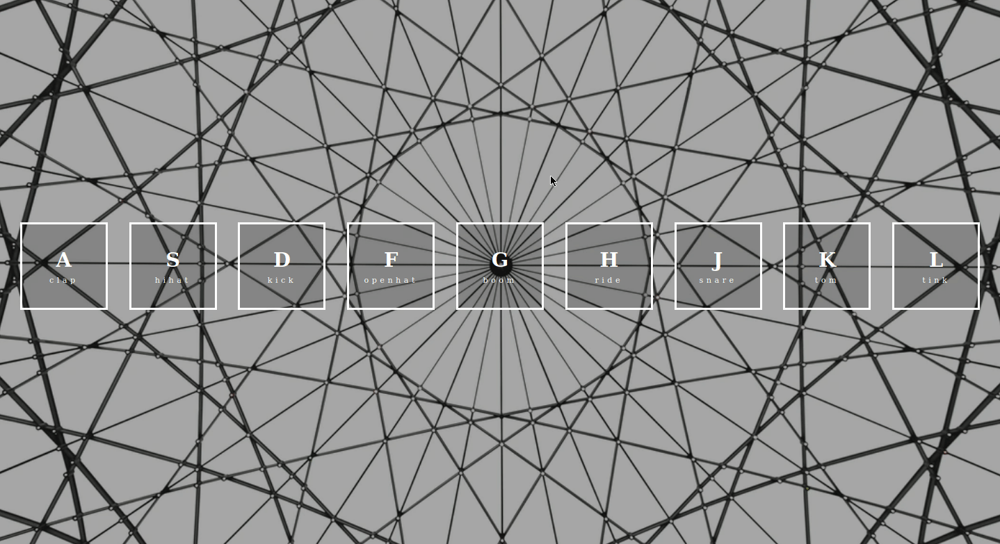

<p align="center">
 
 <h1>Web Drum Kit</h1>
</p>

<p align="center">
 [](https://travis-ci.org/badges/badgerbadgerbadger) 
</p>

<hr>


> Live Site : **https://elegant-ptolemy-2f8de3.netlify.app/**

> Play Drums With Your Keyboard

>  Play Drums On Your Mobile

>  Easy To Use And Easy To Modify Code


<h3>Preview</h3>





<h3>Setup</h3>

```
npm install
```

* Run This Code Inside File To Get Dependencies 

```
gulp
```

- Run This Code To Activate , SASS and JS Minify and Conversion Tasks
- Plus i have added browser-sync for browser reload on every file change 


